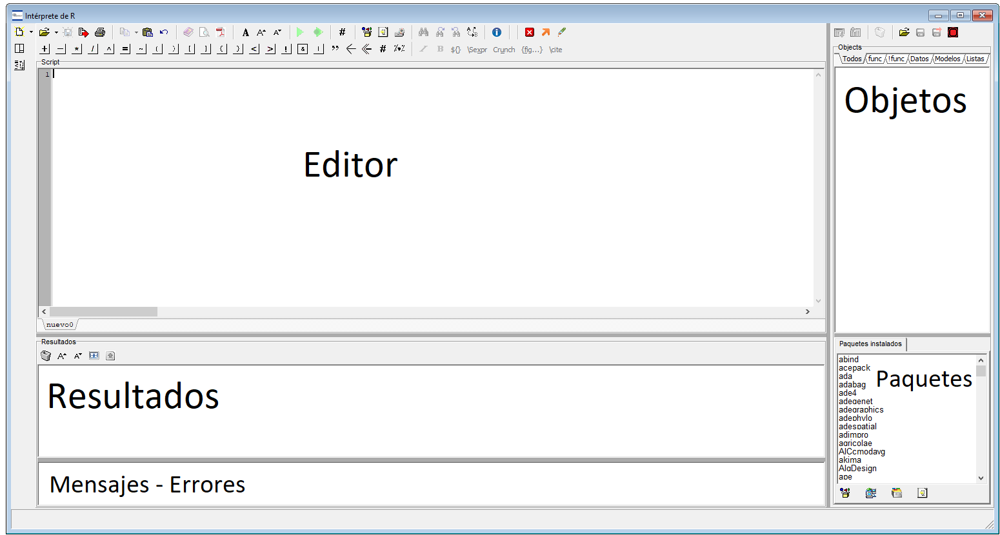

--- 
title: "Introducción al software R"
subtitle: "Notas de clases"
author: 
- Paccioretti Pablo^[pablopaccioretti@agro.unc.edu.ar]
- Bruno Cecilia^[cebruno@agro.unc.edu.ar]
- González Montoro Aldana^[aldana.gonzalez.montoro@unc.edu.ar]
- Nores María Laura^[lalinores@yahoo.com.ar]
site: bookdown::bookdown_site
documentclass: book
bibliography: [book.bib, packages.bib]
biblio-style: apalike
link-citations: yes
description: "Introducción al uso del Software R"
---

# Instalación de programas

R puede ser instalado en múltiples plataformas tales como Windows, MacOS y en 
sistemas basados en Linux. Además hay múltiples entornos de desarrollo 
integrado (*Integrated Development Environment* IDE) los cuales facilitan la 
programación. Ejemplos de este tipo de software es RStudio [@Rstudio] y el 
intérprete de R que contiene InfoStat [@Infostat]. Las interfaces gráficas 
de ambos software son similares.


Links para las descargas:

- [R (windows)](https://cran.r-project.org/bin/windows/base/)
- [RStudio](https://www.rstudio.com/products/rstudio/download/#download)
- [InfoStat](http://www.infostat.com.ar/descargas/demo/infostatinstaller_esp.exe)


## Interfaz de RStudio


La interfaz de RStudio se divide en cuatro paneles.

{ width=80% }

El panel superior izquierdo permite al usuario editar scripts (líneas de código),
para esto puede cargar scripts previamente escritos o escribir nuevos. En el 
panel de abajo a la izquierda (*consola*) se muestran las sentencias de código
ejecutadas y los resultados. En este panel el software se "comunica" con el usuario. 
En los paneles derechos se muestran los objetos cargados en el ambiente de 
trabajo, mientras que en el panel inferior derecho se muestran principalmente los
archivos del directorio de trabajo, gráficos generados durante la sesión y ayudas
de funciones específicas.


## Interfaz del intérprete de InfoStat

La interfaz del intérprete de R en InfoStat se divide en cuatro paneles.

{ width=80% }

El panel superior izquierdo permite al usuario visualizar o editar scripts.
En el panel inferior izquierdo se muestran los resultados de funciones. 
En los paneles derechos se muestran los objetos cargados en el ambiente de 
trabajo, mientras que en el panel inferior derecho se muestran los paquetes 
instalados y en rojo los paquetes cargados en memoria.

```{r include=FALSE}
# automatically create a bib database for R packages
knitr::write_bib(c(
  .packages(), 'bookdown', 'knitr', 'rmarkdown'
), 'packages.bib')
```
